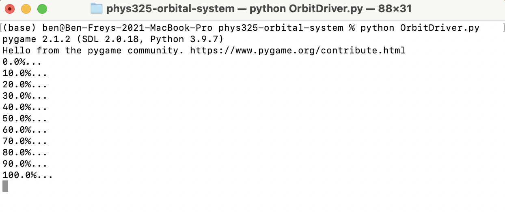

# PHYS 325: Methods of Computational Physics Assignment 7.1 - Animated Orbital System

## Project Overview

Project Assignment Outline PDF: [project_assignment.pdf](docs/project_assignment.pdf)  
 
This project relates to my CISC 480: Senior Capstone course because it was the most difficult assignment I worked on during my Methods of Computational Physics at the University of St. Thomas. As part of the Physics (B.S.) curriculum, this course involved elements of numerical estimation, including: the implementation of differential equations to model the motion of multiple bodies, Runge-Kutta 4th order technique for differential equation solving, and Object-Oriented prorgramming methodologies.
  
NOTE: All code in this repository has been cleaned up since the completion of this course to be featured in my senior portfolio.

## Project Description

The main purpose of this project is to demonstrate the implementation of Pygame, a Python package for integrated animation and data visualization. By using a multi-body orbital simulation program, we can track the movement of multiple bodies through a simulation space (*i.e.* our Solar System). 

## Installation Process
1. $git clone https://github.com/benfrey/phys325-orbital-system
2. $cd phys325-orbital-system
3. $pip install -r requirements.txt
4. $python OrbitDriver.py
 
NOTE: I am using Python 3.9.7 and pip 21.2.4 at the time of writing this.

## Runtime Demonstration
First, the system state is calculated for 600 simulation steps. The calculation process is tracked by the program:

Next, the simulation results are statically drawn to a figure on screen with Matplotlib:

Finally, once exiting the static figure, the simulation results are animated to the screen with Pygame:
